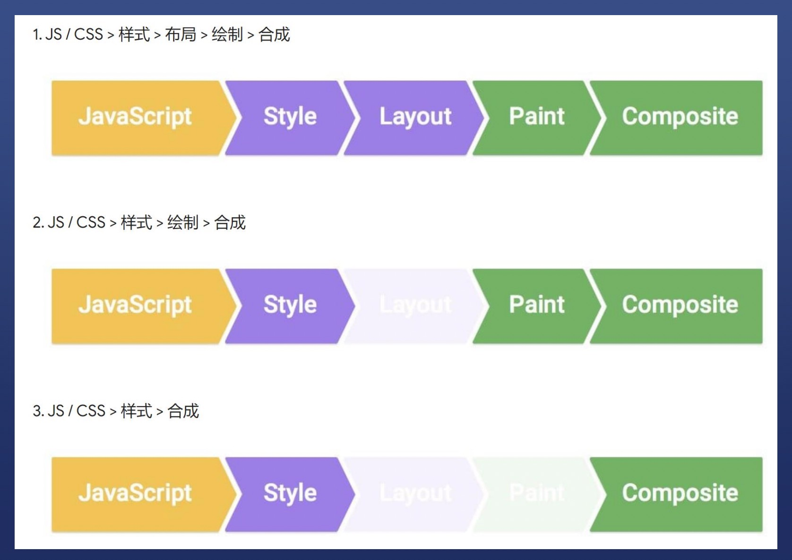

# CSS知识总结

## 浏览器渲染原理
1. 根据HTML构建HTML树
2. 根据CSS构建CSS树
3. 将两颗树合并成一颗渲染树
4. Layout布局（文档流、盒模型、计算大小和位置）
5. Paint绘制（把边框颜色、阴影、文字绘制出来）
6. Compose合成（根据层叠关系展示画面）

## 三种更新方式
1. JS/CSS>样式>布局>绘制>合成
2. JS/CSS>样式>绘制>合成
3. JS/CSS>样式>合成

## CSS动画的两种做法
1. 使用transition（hover时跳动）http://js.jirengu.com/hahodarito/3/edit
2. 使用animation（开始-结束是一个跳动的过程）http://js.jirengu.com/hahodarito/3/edit

## 学习感受
感觉CSS细碎的东西比较多，而且不好记，但是通过不停的尝试、修改可以加深印象。还是需要不断地练习去熟悉每个命令的使用。