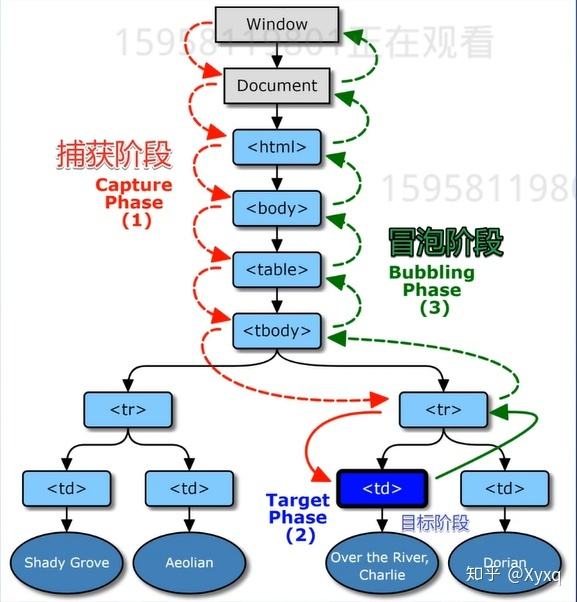

# DOM 事件模型
DOM 的事件操作（监听和触发），都定义在EventTarget接口。所有节点对象都部署了这个接口，其他一些需要事件通信的浏览器内置对象（比如，XMLHttpRequest、AudioNode、AudioContext）也部署了这个接口。

该接口主要提供三个实例方法。
```js
addEventListener：绑定事件的监听函数
removeEventListener：移除事件的监听函数
dispatchEvent：触发事件
```
# 事件模型
一个事件发生后，会在子元素及父元素之间进行传播（propagation），这种传播分为三个阶段。

（这种三阶段的传播模型，使得同一个事件会在多个节点上触发。）

由外向内找监听函数就是事件捕获
在目标节点触发事件
由内而外找监听函数就是事件冒泡
通俗一点来说就是一个事件被触发时，浏览器会自动从用户操作标签外的最上级标签逐渐向里检查是否有相同事件，如果有则触发，如果没有则继续向下检查知道用户操作的标签，这过程称为捕获，此时浏览器会继续由用户操作标签继续向是上级标签检查，如果有相同事件则触发，如果没有则继续向上检查直到最上级元素为止，此过程称为冒泡。（有监听函数就执行，并提供事件信息，没有就跳过）

事件传播的最上层对象是window，上例的事件传播顺序，在捕获阶段依次为window、document、html、body、父节点、目标节点，在冒泡阶段依次为目标节点、父节点、body、html、document、window。

DOM事件传播的三个阶段：捕获阶段，目标阶段，冒泡阶段

# 点击事件
```js
<div class="grandfather">
  <div class="father">
    <div class="son"></div>
    word
  </div>
</div>
```
即.grandfather>.father>.son

给三个div分别添加事件的监听fnYe/fnBa/fnEr

提问1：点击了谁？

点击文字，算不算点击儿子？

点击文字，算不算点击爸爸？

点击文字，算不算点击爷爷？

答案：都算

提问2：调用循序

点击文字，最先调用fnYe/fnBa/fnEr中的那一个函数？

答案：都行

# 捕捉和冒泡


# 代码演示
html代码
```html
<!DOCTYPE html>
<html>
<head>
  <meta charset="utf-8">
  <title>JS Bin</title>
</head>
<body>
<div class="level1 x">
  <div class="level2 x">
    <div class="level3 x">
      <div class="level4 x">
        <div class="level5 x">
          <div class="level6 x">
            <div class="level7 x">
              
            </div>
          </div>
        </div>
      </div>
    </div>
  </div>
</div>

</body>
</html>
```
CSS代码
```css
* {
  box-sizing: border-box;
}
div[class^=level] {
  border: 1px solid;
  border-radius: 50%;
  display: inline-flex;
}
.level1 {
  padding: 10px;
  background: purple;
}
.level2 {
  padding: 10px;
  background: blue;
}
.level3 {
  padding: 10px;
  background: cyan;
}
.level4 {
  padding: 10px;
  background: green;
}
.level5 {
  padding: 10px;
  background: yellow;
}
.level6 {
  padding: 10px;
  background: orange;
}
.level7 {
  width: 50px;
  height: 50px;
  border: 1px solid;
  background: red;
  border-radius: 50%;
}
.x{
  background: transparent;//把元素的变为透明
}
```
Javascript代码
```js
const level1 = document.querySelector('.level1')
const level2 = document.querySelector('.level2')
const level3 = document.querySelector('.level3')
const level4 = document.querySelector('.level4')
const level5 = document.querySelector('.level5')
const level6 = document.querySelector('.level6')
const level7 = document.querySelector('.level7')

let n = 1
 const fm = (e)=>{
  const t = e.currentTarget
  setTimeout(()=>{  
    t.classList.remove('x')
  },n*1000)
  n+=1
}
 const fa = (e)=>{
   const t =e.currentTarget
   setTimeout(()=>{
     t.classList.add('x')
   },n*1000)
   n+=1
 }

level1.addEventListener('click',fm,true)
level1.addEventListener('click',fa)
level2.addEventListener('click',fm,true)
level2.addEventListener('click',fa)
level3.addEventListener('click',fm,true)
level3.addEventListener('click',fa)
level4.addEventListener('click',fm,true)
level4.addEventListener('click',fa)
level5.addEventListener('click',fm,true)
level5.addEventListener('click',fa)
level6.addEventListener('click',fm,true)
level6.addEventListener('click',fa)
level7.addEventListener('click',fm,true)
level7.addEventListener('click',fa)
```