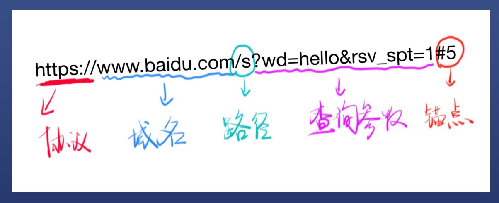
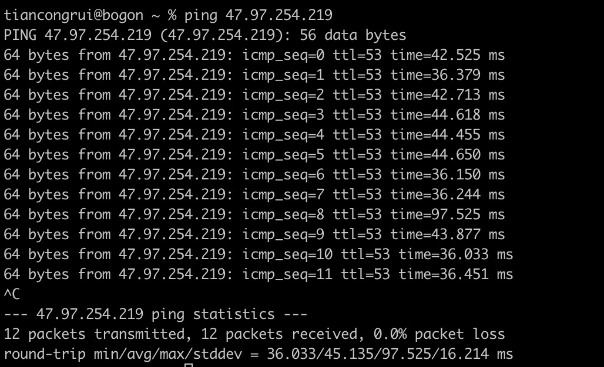

# 浅析URL
## URL包含内容
1. 协议
2. 域名/IP
域名就是对IP的别称，一个域名可以对应不同IP，一个IP也可以对应不同域名。
3. 端口号
一共有65535个端口，HTTP服务使用80端口号，HTTPS使用443端口，FTP使用21端口。
4. 路径
通过修改路径可以访问不同页面。
5. 查询参数
通过修改参数可以查看不同内容。
6. 锚点
通过修改锚点可以查看不同内容。

## DNS的作用
1. 域名和IP通过DNS对应起来。
2. 通过nslookup 域名可以正向解析出IP地址

## IP的作用
在因特网中，它是能使连接到网上的所有计算机网络实现相互通信的一套规则，规定了计算机在因特网上进行通信时应当遵守的规则。任何厂家生产的计算机系统，只要遵守 IP协议就可以与因特网互连互通。

## ping命令
ping是用来探测本机与网络中另一主机之间是否可达的命令，如果两台主机之间ping不通，则表明这两台主机不能建立起连接。ping是定位网络通不通的一个重要手段。

## 域名
1. 域名就是对IP的别称，一个域名可以对应不同IP，这个叫均衡负载，防止一台机器扛不住，一个IP可以对应不同域名，这个叫做共享主机。
2. www.baidu.com和baidu.com不是同一个域名，com是顶级域名（company），baidu.com是二级域名，www.baidu.com是三级域名，他们是父子关系。